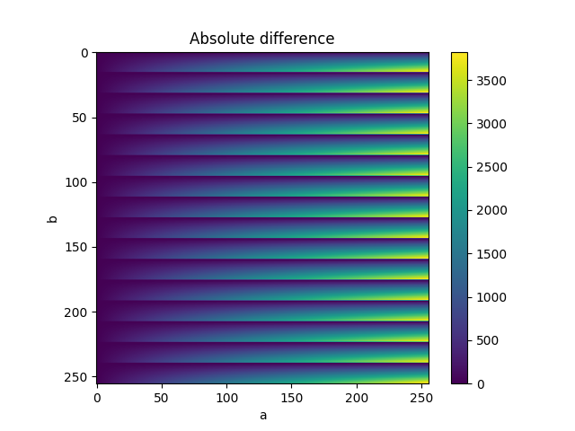

# ArithsGen – tool for arithmetic circuits generation
[](https://www.python.org/)
[](https://ehw-fit.github.io/ariths-gen)


## Description
ArithsGen presents an open source tool that enables generation of various arithmetic circuits along with the possibility to export them to various formats which all serve their specific purpose. C language for easy simulation, Verilog for logic synthesis, BLIF for formal verification possibilities and CGP to enable further global optimization.

In contrast to standard HDL languages Python supports
* Multiple output formats (BLIF, Verilog, C, Integer netlist)
* Advanced language construction (better configuration, inheritance, etc.)
* Support of various PDKs (for using library cells as half-adders and full-adders)

## Prebuild circuits
To enable fast work with the circuits, we published pre-build arithmetic circuits in various formats in [generated_circuits](generated_circuits) folder and as a [Release](https://github.com/ehw-fit/ariths-gen/releases).

### Usage
```bash
python3 generate_test.py
cd test_circuits
ls
```

### Example of generation
```py
#Example generation of Verilog representation of 8-bit unsigned dadda multiplier that uses cla to provide the final product
a = Bus(N=8, prefix="a_bus")
b = Bus(N=8, prefix="b_bus")

u_dadda = UnsignedDaddaMultiplier(a=a, b=b, prefix="h_u_dadda_cla8", unsigned_adder_class_name=UnsignedCarryLookaheadAdder)
u_dadda.get_v_code_hier(open("h_u_dadda_cla8.v", "w"))
```

### Simple arithmetic circuits
See [Ripple Carry Adder](ariths_gen/multi_bit_circuits/adders/ripple_carry_adder.py) file for a basic example.

### Complex circuits
It is possible to combine some basic circuits to generate more complex circuits (such as MAC). The design can be parametrised (i.e., you can pass `UnsignedArraymultiplier` as an input parameter).

```py
from ariths_gen.core.arithmetic_circuits.arithmetic_circuit import ArithmeticCircuit
from ariths_gen.core.arithmetic_circuits import GeneralCircuit
from ariths_gen.wire_components import Bus, Wire
from ariths_gen.multi_bit_circuits.adders import UnsignedRippleCarryAdder
from ariths_gen.multi_bit_circuits.multipliers import UnsignedArrayMultiplier, UnsignedDaddaMultiplier
import os

class MAC(GeneralCircuit):
    def __init__(self, a: Bus, b: Bus, r: Bus, prefix: str = "", name: str = "mac", **kwargs):
        super().__init__(prefix=prefix, name=name, out_N=2*a.N+1, inputs=[a, b, r], **kwargs)
        assert a.N == b.N
        assert r.N == 2 * a.N

        self.mul = self.add_component(UnsignedArrayMultiplier(a=a, b=b, prefix=self.prefix, name=f"u_arrmul{a.N}", inner_component=True))
        self.add = self.add_component(UnsignedRippleCarryAdder(a=r, b=self.mul.out, prefix=self.prefix, name=f"u_rca{r.N}", inner_component=True))
        self.out.connect_bus(connecting_bus=self.add.out)

# usage
if __name__ == "__main__":
    os.makedirs("test_circuits/mac", exist_ok=True)
    mymac = MAC(Bus("a", 8), Bus("b", 8), Bus("acc", 16))
    mymac.get_v_code_hier(open("test_circuits/mac/mac_hier.v", "w"))
    mymac.get_c_code_hier(open("test_circuits/mac/mac_hier.c", "w"))
    mymac.get_c_code_flat(open("test_circuits/mac/mac_flat.c", "w"))
```

## Documentation
The automatically generated documentation is available at 
https://ehw-fit.github.io/ariths-gen/ . 


## Supporting various PDK kits
When one uses a specific process design kit (PDK), it is not effective to implement half- and full-adders using two-inputs logic gates. These circuits are directly implemented as CMOS modules and are more effective than heuristic optimization by synthesis tool. If you want to use for example FreePDK45 library, you can call a following function before verilog code generating.

```py
from ariths_gen import set_pdk45_library
set_pdk45_library()
```

You can add a support of arbitrary PDK (see an [example](ariths_gen/pdk.py) ).


## Approximate circuits
Besides the accurate arithmetic circuits you can generate some approximate circuits. Currently we support _Broken Array Multiplier_ and _Truncated Multiplier_ both with fully connected architectures composed from half/full adders as well as faster implementations using carry save multiplier. For more details please follow files in folder [approximate_multipliers](ariths_gen/multi_bit_circuits/approximate_multipliers/). You can simply run 
```bash
python3 generate_axmuls.py
```
to get the approximate circuits.

The module also supports evaluation of the proposed circuits. You can call the instation as a function (even with numpy-array input) to obtain the results of multiplication operation.

```py
from ariths_gen.wire_components.buses import Bus
from ariths_gen.multi_bit_circuits.approximate_multipliers import UnsignedBrokenArrayMultiplier
a = Bus(N=8, prefix="a_bus")
b = Bus(N=8, prefix="b_bus")

# Create BAM 
bam = UnsignedBrokenArrayMultiplier(a, b, horizontal_cut=4, vertical_cut=4)

print("43 * 84 = ", bam(43, 84), " expected: ", 43 * 84)
# 43 * 84 =  3440  expected:  3612
```
for all of the possible combinations.

```py
# Evaluate all using b'casting
import numpy as np
import matplotlib.pyplot as plt
va = np.arange(256).reshape(1, -1)
vb = va.reshape(-1, 1)
r = bam(va, vb)

cax = plt.imshow(np.abs(r - (va * vb)))
plt.colorbar(cax)
plt.title("Absolute difference")
plt.xlabel("a")
plt.ylabel("b")

print("Mean average error", np.abs(r - (va * vb)).mean())
# Mean average error 956.25
```


## Formal verification
The `yosys_equiv_check.sh` script enables to formally check the equivalence of generated Verilog and BLIF representations of the same circuit.
It uses the Yosys Open SYnthesis Suite tool by Claire Xenia Wolf. For further information, please visit: http://bygone.clairexen.net/yosys/documentation.html.

## Execute permission
```bash
chmod +x yosys_equiv_check.sh
```

### Usage
```bash
./yosys_equiv_check.sh -v "verilog_file" -b "blif_file" -m "method" [-H]
```

For more detailed description of script's usage, use help.
```bash
./yosys_equiv_check.sh -h|--help
```

## CGP testing
The `chr2c.py` script converts the input CGP chromosome generated by ArithsGen to the corresponding C code and prints it to standard output.

### Usage
```bash
python3 chr2c.py input.chr > output.c
```
